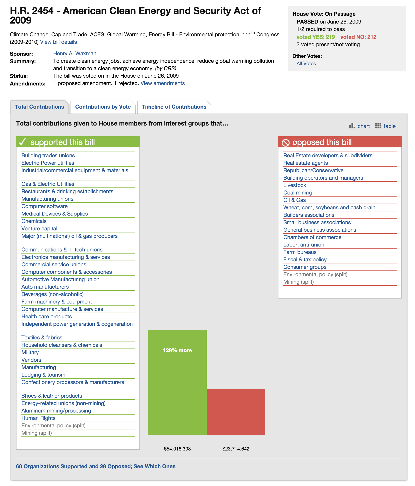

# Predicting Congressional Bill Outcomes #

Over the course of this quarter, we built a predictor that identifies which US bills will succeed in both the House and in the Senate. Our motivation for this project was to learn about what strategic tools have the greatest marginal impact in Congress, and our starting hypothesis was that lobbying dollars spent in one direction would be the single most impactful factor.

The predictor is modeled on Congressional data from the 109th - 113th Congresses (spanning the years 1997 - 2010) from a wide range of sources. We will go into further detail about these sources in the "Infrastructure" section. We evaluated our system based on whether or not we were able to predict the outcome of a particular bill correctly.

## Data Sources & Infrastructure ##

We relied on several datasets to train our classifier. Specifically, we used:

#### Data from GovTrack & Thomas.gov ####

We downloaded metadata of all bills from the 109th - 113th Congresses from the [@unitedstates](https://github.com/unitedstates) project's [bulk data downloads page](https://github.com/unitedstates/congress/wiki). This data originates from [thomas.gov](http://thomas.gov) in a semi-structured format. In coordination with a group of open source contributors, GovTrack scraped this government website and stored the data in structured JSON. Documentation on the structure of these JSON files can be found on [this page](https://github.com/unitedstates/congress/wiki/bills) in the group's wiki. We relied on this data for our bill outcomes as well as other metadata including amendment history, sponsor and co-sponsor information, and details about the relevant congressional committees.

#### MapLight's Congressional Bills Data ####

We relied most heavily upon [MapLight's data](http://maplight.org/us-congress/bill/search/description?page=0&solrsort=ds_last_action%20asc&namespace=map_bill_search) about the contributions given to members of Congress from interest groups that support or oppose various bills. You can find a screenshot of a bill profile page to the right.

We want to give a shoutout to the MapLight team's [fantastic work](http://maplight.org/content/about-maplight#howwedoit). Without their careful, nonpartisan analysis, this project would not have been possible.

Still, the data was not available in a clean, structured format, so much of our effort was spent on extracting and preprocessing the information from MapLight's thousands of paginated webpages that contain the information we needed. 

We pulled information on each session for each kind of bill with a Python script that scraped the Maplight data for the 109th - 114th congressional sessions, where each bill had an outcome (SUCCESS or FAIL) from GovTrack associated with it. Many bills had several hundred features, including legislator lists, supporting and opposing industries, and organizations with their dollar amounts contributed.

We have made the structured data available [here](https://www.dropbox.com/home/CS221%20scripts) so that others can play around with it, too.

##### Possible Statuses: #####

*Note:* For bills from previous congresses (i.e. > 2 years old), if the status is "Referred to committee" or "Introduced" or "Reported to committee" then it’s a failure.

- **Enacted Laws:** Enacted bills and joint resolutions (both bills and joint resolutions can be enacted as law)
- **Passed Resolutions:** Passed resolutions (for joint and concurrent resolutions, this means passed both chambers)
- **Got A Vote:** Bills and joint/concurrent resolutions that had a significant vote in one chamber
- **Failed Legislation:** Bills and resolutions that failed a vote on passage or failed a significant vote such as cloture, passage under suspension, or resolving differences
- **Vetoed Bills (w/o Override):** Bills that were vetoed and the veto was not overridden by Congress
- **Other Legislation:** Bills and resolutions that were introduced, referred to committee, or reported by committee but had no further action

##### Possible Bill Types: #####

- **HR:** House Bill
- **S:** Senate Bill
- **HJ Res:** House Joint Resolution
- **SJ Res:** Senate Joint Resolution
- **H Con Res:** House Concurrent Resolution
- **S Con Res:** Senate Concurrent 
- **H Res:** House Simple Resolution
- **S Res:** Senate Simple Resolution

## Approach ##

We modeled the challenge of classifying bill outcomes as a classic machine learning task. Using the data on congressional bills from the sources listed above, we were able to experiment with several machine learning approaches for the classification task.

#### Baseline ####

Using a conjecture from a previous study from Michigan State on bill advancement (see the section on Prior Work), we established a baseline prediction of a bill’s success using just one feature, the total sum of lobbying money in support for that bill.

#### Oracle ####

Our ground truth for bill outcomes is taken from our bill status data with GovTrack. In order to interpret bill status as a binary outcome (SUCCESS or FAIL), we mapped all possible statuses to their most likely outcomes. (See the section on GovTrack Data.)

#### Main Approach ####

Our first step after collecting and cleaning the data was representing it in an appropriate feature form. Because we wanted to include unique lobbyists, legislators, organizations, and industries in our features and their effect on the bill outcome, we took on a text-classification "bag of words" approach to representing these features. For our particular data, we associated lobbying amounts (either given or received for, and in support or against a bill) to each feature instead of binary indicators (feature is present vs. not present). A few of the different numerical representations we considered were absolute value of money for a bill, ratio of money for and against a bill, and the net sum of the money for a bill (i.e. money given/received in favor of the bill - money given/received in opposition to the bill). Some examples of resulting features are given below:

- If Senator Grinch received $14,000 total in support for **Bill #1919: World Peace** and $30,000 against, then the feature "Senator Grinch" would map to `-16,000`.
- If the sum for representatives in a certain voting district of California was \$3,000 in support and $1,000 against, then the feature "CA-2" would map to `2000`.
- If the manufacturing industry contributed a total of \$40,000 against and \$0 in support, then the feature "manufacturing" would map to `-40,000`.
- If organization "Red Cross" donated money in support of the bill, then the feature "Red Cross" would map to binary value "FOR".
- The date a bill is introduced is converted in to a nominal - for example 01/01/2013 would be 1356998400, the unix representation of the timestamp.

With our aggregated training examples, our resulting data included over 11,000 features for just under 3,000 bills. In order to further explore our features, we performed both Principal Components Analysis (PCA) and Chi-Squared evaluation to rank these features in order of significance. With Principal Component Analysis, features are recombined to form new dimensions. Looking at our top new dimensions in PCA, we can see that they are primarily linear combinations of weights from various legislators and organizations that align similarly in voting incentives and decisions. When looking at features with the highest chi-squared scores, we can see that lobbying money directed towards a district or state has a greater than chance impact on the outcome. A full list of the top 20 PCA dimensions and 20 features with the highest chi-squared scores given in the feature evaluation section.

Our second step was to take our newly formed feature representation and assess a second baseline accuracy from naive or linear supervised classification algorithms. We used **Naive Bayes** and **Logistic regression** respectively to accomplish this, as they are relatively quick and simple classification algorithms.

Our final step was to move to more sophisticated approaches that were more suitable for dealing with high-dimensional feature spaces. Similar to methods in classc text classification, we decided to use models like **Support Vector Machines** (SVMs) that are robust but also capable of modeling non-linear boundaries. We also experimented with Perceptron to see if this single-layer network could more effectively capture relationships betwee our various features. In order to perform both classifications, however, we had to first reduce our feature space using **Principal Component Analysis** (PCA). In addition to reducing our feature space from ~11,000 to ~500, PCA also helped us discover that these 500 features capture the most variation in the data.

The full list of algorithms we applied to the data is listed below - for all algorithms, we employed a 10-fold cross evaluation to determine performance:

- K-Means
- Naive Bayes with and without PCA
- Logistic Regression
- SVM with PCA
- Perceptron with PCA

We will go into further detail about the results we achieved with each algorithm in the "Error Analysis" section.

## Literature Review & Prior Work ##

#### Statistics from previous Congresses ####

GovTrack provided an important overview of the bill success rates of previous congresses, which you can find [here](https://www.govtrack.us/congress/bills/statistics). We did not directly utilize these statistics while building our predictors, but they provided important insight for understanding the basic probability distributions for possible bill outcomes. For instance, we had not realized how few bills explicitly fail based on a vote. According to GovTrack's data, nearly 0% of bills are considered "failed legislation". The vast majority of bills that don't become law simply die in committee or some other intermediate step.

#### Lobbying & Congressional Bill Advancement ####

A Michigan State University paper titled [*Lobbying & Congressional Bill Advancement*](http://www.academia.edu/8031510/Lobbying_and_Congressional_Bill_Advancement) studied the influence of lobbying on the advancement of congressional legislation. It found that "the amount of interest group lobbying is associated with majority party sponsorship, wide cosponsorship, and high-profile issues" and that "lobbying helps predict whether bills advance through committee and each chamber, independent of congressional factors typically associated with bill advancement".

We began this project with the hypothesis that lobbying dollars would be a helpful predictor in determining bill outcomes. This paper reaffirmed our hypothesis, and as a result we made sure to include a variety of features in our algorithms that captured as many perspectives on lobbying behavior as possible. In particular, we included the following features as a direct result of the findings in this paper:

- Net dollars spent on the bill (amount spent supporting minus the amount spent opposing it)
- A series of features, each representing the absolute sum that a given legislator received regarding that bill
- Absolute sum spent on the bill from a particular industry
- A series of features, each representing the position that a particular organization or industry took on the bill

#### Predicting Congressional Bill Outcomes ####

In 2012, Stanford students took on a very similar question in [*Predicting Congressional Bill Outcomes*](http://cs229.stanford.edu/proj2012/CainChuaGampong-PredictingCongressionalBillOutcomes.pdf) for CS 229, the machine learning class. However, their approach was significantly different from ours. The 229 team aimed to answer the question "Can we predict the voting behavior of a Representative on a given bill using only the frequency of words in the bills text?", and they relied on text classification. Meanwhile, we aimed to predict the aggregate result of a vote (i.e. whether or not the bill succeeded), and we relied on a broader set of features including lobbying data and categorical information.

#### Lobbying on Effective Legislation: Revolving Door Lobbyists’ Targeted Legislative Influence ####

A University of Texas at Austin paper titled [*Lobbying on Effective Legislation: Revolving Door Lobbyists’ Targeted Legislative Influence*](http://www.papers.ssrn.com/sol3/papers.cfm?abstract_id=2592472) studied the varying levels of influence exerted by lobbyists on each step of the legislative process. By linking lobbyists’ professional backgrounds to the bills in which they’ve been involved, the paper found that "lobbyists with significant professional experience on Capitol Hill are more likely to lobby on bills perceived as important by political elites and institutionally privileged by party leaders’ agendas". While the results of this paper were interesting, they were orthogonal to the direction our project ended up taking.

#### Determining Swing Congressman Through Lobbying ####

A CalTech student project called [*Determining Swing Congressman Through Lobbying*](http://www.predcongressvoters.blogspot.com) discovered that most swing Republican congressmen receive little in terms of lobbying dollars. Their explanation for this phenomenon was that "swing republicans have little influence over other swing republicans and the entire group is small to begin with. Therefore when proposing a bill, it is in your best interest to try to get as many people from the opposing faction to switch to your side with the hope that they have enough influence to change the minds of the their particular hidden node."

## Error Analysis ##

### Naive Bayes with Principal Component Analysis (PCA) ###

##### Summary #####

|                                  |            |           |
| -                                | -          | -         |
| Correctly Classified Instances   | 705        | 26.1208% |
| Incorrectly Classified Instances | 1994       | 73.8792% |

We began by using Naive Bayes as our initial predictor, which performed poorly in the case of a PCA-transformed space. The predictor correctly classified points in the test set just over 26% of the time, far worse than the 50% that one would expect with chance. Our initial reaction was one of shock, but after some reflection we realized that the source of the problem was likely the approach's "naive" assumption of conditional independence between each of the features. This joint probability model can be expressed as:

It's intuitively obvious that many of the features are closely correlated. In particular, we included a wide variety of features representing many different aspects of the lobbying processes, and as a result one would expect there to be many features that communicate overlapping information about a given bill.

In comparison to the classification in untransformed space, we can see that Naive Bayes suffers after pre-processing with PCA. This can be explained by the fact that PCA extracts features that maximize variation within the data, and is heavily dependent on covariations between features. Naive Bayes, on the other hand, applies a fundamentally different assumption with the data when creating its models and could even derive distortions from the PCA-selected features.

##### Detailed Accuracy By Class #####

|               | [**Precision**](https://en.wikipedia.org/wiki/Precision_and_recall#Precision) | [**Recall**](https://en.wikipedia.org/wiki/Precision_and_recall#Recall) | [**F-Measure**](https://en.wikipedia.org/wiki/Precision_and_recall#F-measure) |  Class   |
| -             | -         | -      | -         |              |
|               | 0.067     | 0.806  | 0.124     | SUCCESS      |
|               | 0.943     | 0.223  | 0.361     | FAILURE      |
| Weighted Avg. | 0.886     | 0.261  | 0.346     |              |

##### Confusion Matrix #####

| a    | b   | <-- classified as |
| -    | -   | -                 |
| 141  | 34  | a = SUCCESS       |
| 1960 | 564 | b = FAIL          |

### Naive Bayes without PCA ###

##### Summary #####

|                                  |      |           |
| -                                | -    | -         |
| Correctly Classified Instances   | 2060 | 75.7075% |
| Incorrectly Classified Instances | 661  | 24.2925% |

In comparison to the classification in untransformed space, we can see that Naive Bayes suffers after pre-processing with PCA. This can be explained by the fact that PCA extracts features that maximize variation within the data, and is heavily dependent on covariations between features. Naive Bayes, on the other hand, applies a fundamentally different assumption with the data when creating its models and could even derive distortions from the PCA-selected features.

##### Detailed Accuracy By Class #####

|               | [**Precision**](https://en.wikipedia.org/wiki/Precision_and_recall#Precision) | [**Recall**](https://en.wikipedia.org/wiki/Precision_and_recall#Recall) | [**F-Measure**](https://en.wikipedia.org/wiki/Precision_and_recall#F-measure) | Class   |
| -             | -         | -      | -         | -       |
|               | 0.131     | 0.486  | 0.206     | SUCCESS |
|               | 0.956     | 0.776  | 0.857     | FAIL    |
| Weighted Avg. | 0.902     | 0.757  | 0.814     |         |

##### Confusion Matrix #####

| a   | b    | <-- classified as |
| -   | -    | -                 |
| 86  | 91   | a = SUCCESS       |
| 570 | 1974 | b = FAIL          |

### Logistic Regression after Principal Component Analysis (PCA) ###

##### Summary #####

[Logistic Regression](https://en.wikipedia.org/wiki/Logistic_regression) was quite effective at predicting bill outcomes, coming in second place with an 83.7% success rate. The feature space was too large to perform logistic regression with reasonable time and computation power, so we had to first transform the data with PCA before creating the models.

Intuitively, logistic regression in conjunction to PCA should perform relatively better than Naive Bayes; logistic regression is dependent on covariances and does not make the same probabilistic assumptions about independence as Naive Bayes. In fact, [Aguilera et al.](http://citeseerx.ist.psu.edu/viewdoc/download?doi=10.1.1.109.3106&rep=rep1&type=pdf) proposes that PCA actually enhances logistic regression of high-dimensional, multi-collinear data. Given this, it is no surprise that logistic regression results in a significant improvement from the baseline performance.

|                                  |      |           |
| -                                | -    | -         |
| Correctly Classified Instances   | 2259 | 83.6977% |
| Incorrectly Classified Instances | 440  | 16.3023% |

##### Detailed Accuracy By Class #####

|               | [**Precision**](https://en.wikipedia.org/wiki/Precision_and_recall#Precision) | [**Recall**](https://en.wikipedia.org/wiki/Precision_and_recall#Recall) | [**F-Measure**](https://en.wikipedia.org/wiki/Precision_and_recall#F-measure) |  Class   |
| -             | -         | -      | -         |              |
|               | 0.125     | 0.251  | 0.167     | SUCCESS      |
|               | 0.944     | 0.878  | 0.91      | FAILURE      |
| Weighted Avg. | 0.891     | 0.837  | 0.861     |              |

##### Confusion Matrix #####

| a   | b    | <-- classified as |
| -   | -    | -                 |
| 44  | 131  | a = SUCCESS       |
| 309 | 2215 | b = FAIL          |

### Support Vector Machine after Principal Component Analysis (PCA) ###

##### Summary #####

[Support Vector Machine](https://en.wikipedia.org/wiki/Support_vector_machine) performed the best out of the four methods we used, correctly predicting the outcome of almost 94% in 10-fold cross validation. This is not surprising, as SVM is generally a highly effective algorithm for large feature spaces, robust due to regularizations, and fast due to kernel use. In addition, SVM is capable of finding non-linear decision boundaries, which is ideal for features like ours with complex or dynamic relationships. Due to the performance and speed of this algorithm, we would most likely favor SVM over other approaches in this analysis.

|                                  |      |           |
| -                                | -    | -         |
| Correctly Classified Instances   | 2530 | 93.7384% |
| Incorrectly Classified Instances | 169  | 6.2616%  |

##### Detailed Accuracy By Class #####

|               | [**Precision**](https://en.wikipedia.org/wiki/Precision_and_recall#Precision) | [**Recall**](https://en.wikipedia.org/wiki/Precision_and_recall#Recall) | [**F-Measure**](https://en.wikipedia.org/wiki/Precision_and_recall#F-measure) | Class   |
| -             | -     | -     | -     |         |
|               | 0.074 | 0.003 | 0.65  | SUCCESS |
|               | 0.997 | 0.926 | 0.94  | FAILURE |
| Weighted Avg. | 0.937 | 0.866 | 0.921 |         |

##### Confusion Matrix #####

| a  | b    | <-- classified as |
| -  | -    | -                 |
| 13 | 162  | a = SUCCESS       |
| 7  | 2517 | b = FAIL          |

### Voted Perceptron after Principal Component Analysis (PCA) ###

##### Summary #####

[Voted Perceptron](http://curtis.ml.cmu.edu/w/courses/index.php/Voted_Perceptron) achieved an accuracy of 65% on our 10-fold cross validations. One explanation for the sub-par performance is that this algorithm is a "shallow" single layer variation of the far more powerful neural networks. In order to achieve higher accuracy in our classifications, a better approach would be applying full neural networks instead of the voted perceptron. One disadvantage to this however is that Perceptron was by far the slowest of all our algorithms (and neural nets even slower), which also presents a significant challenge in computational power and time.

Number of perceptrons = 1133

|                                  |      |          |
| -                                | -    | -        |
| Correctly Classified Instances   | 1755 | 65.0241% |
| Incorrectly Classified Instances | 944  | 34.9759% |

##### Detailed Accuracy By Class #####

|               | [**Precision**](https://en.wikipedia.org/wiki/Precision_and_recall#Precision) | [**Recall**](https://en.wikipedia.org/wiki/Precision_and_recall#Recall) | [**F-Measure**](https://en.wikipedia.org/wiki/Precision_and_recall#F-measure) | Class   |
| -             | -         | -      | -         | -       |
|               | 0.079     | 0.411  | 0.132     | SUCCESS |
|               | 0.942     | 0.667  | 0.781     | FAIL    |
| Weighted Avg. | 0.886     | 0.65   | 0.739     |         |

##### Confusion Matrix #####

| a   | b    | <-- classified as |
| -   | -    | -                 |
| 72  | 103  | a = SUCCESS       |
| 841 | 1683 | b = FAIL          |

## Feature Analysis ##

### Principal Component Analysis (PCA) – Top 20 Dimensions ###

1. -0.061Steny-H_-Hoyer-0.06Jim-Clyburn-0.059Steve-Israel-0.059Henry-Cuellar-0.058Aaron-Schock- 
1. -0.081Zack-Space-0.081Lincoln-Davis-0.08Stephanie-Herseth-Sandlin-0.078Ron-Klein-0.078Jim-Marshall- 
1. -0.07Carol-Shea-Porter-0.065Julia-Brownley-0.064Donna-F_-Edwards-0.064Alan-S_-Lowenthal-0.063Ann-M_-Kuster- 
1. -0.093Susan-M_-Collins-0.093Dianne-Feinstein-0.092Andrew-Lamar-Alexander-0.091Mary-L_-Landrieu-0.091John-Cornyn- 
1. '0.09 National-Solid-Wastes-Management-Association+0.09 Coalition-for-a-Democratic-Workplace+0.09 American-Fire-Sprinkler-Association+0.09 National-Association-of-Electrical-Distributors+0.09 Forging-Industry-Association...' numeric
1. -0.131United-Technologies-0.131General-Mills-0.131Texas-Instruments-0.128Emerson-0.128Cisco-Systems- 
1. -0.141Jim-Walsh-0.141Vito-Fossella-0.141Rahm-Emanuel-0.141Mike-Ferguson-0.14Ric-Keller- 
1. -0.083National-Association-for-Hispanic-Elderly-0.083Social-Security-Works-0.083International-Union-of-Bricklayers-and-Allied-Craftworkers-0.081National-Association-of-Social-Workers-0.076Coalition-of-Labor-Union-Women- 
1. '0.141Norm-Coleman+0.14 Mel-Martinez+0.14 Gordon-Smith+0.14 George-Voinovich+0.14 Mary-Elizabeth-Dole...' numeric
1. 0.138Academy-of-Nutrition-and-Dietetics+0.138National-Association-of-States-United-for-Aging-and-Disabilities+0.138AIDS-United+0.138National-Skills-Coalition+0.138Association-of-Public-Health-Laboratories- 
1. 0.103IPNav-0.103Genzyme-0.103Milliken-_amp_-Company-0.103SanDisk-0.103CheckFree- 
1. -0.131Electronics-for-Imaging-0.131Genzyme-0.131Bristol-Myers-Squibb-0.131Milliken-_amp_-Company-0.131Northrop-Grumman- 
1. 0.118National-Council-of-Women_s-Organizations+0.118Feminist-Majority-Foundation+0.118Women-Employed+0.106National-Hispanic-Council-on-Aging+0.106Labor-Council-for-Latin-American-Advancement- 
1. 0.152American-Nursery-_amp_-Landscape-Association+0.152Entertainment-Merchants-Association+0.152Jewelers-of-America+0.152Outdoor-Amusement-Business-Association+0.152National-Association-of-College-Stores- 
1. -0.13United-Cerebral-Palsy-0.12National-Council-of-Negro-Women-0.12National-Caucus-and-Center-on-Black-Aged-0.12Alzheimer_s-Foundation-of-America-0.12Food-Research-and-Action-Center- 
1. 0.165American-College-of-Osteopathic-Surgeons+0.165Society-of-Critical-Care-Medicine+0.165College-of-American-Pathologists+0.165American-College-of-Emergency-Physicians+0.165Society-of-Thoracic-Surgeons- 
1. -0.14National-Association-of-State-Directors-of-Special-Education-0.14Gay--Lesbian-_amp_-Straight-Education-Network+0.129American-Humane-Association+0.129National-Association-of-Biology-Teachers+0.129American-Planning-Association- 
1. -0.102National-Association-of-State-Directors-of-Special-Education-0.102Gay--Lesbian-_amp_-Straight-Education-Network-0.086Easter-Seals-0.077Great-Lakes-United-0.077National-Association-of-Biology-Teachers- 
1. -0.14National-Association-of-State-Directors-of-Special-Education-0.14Gay--Lesbian-_amp_-Straight-Education-Network+0.129American-Humane-Association+0.129National-Association-of-Biology-Teachers+0.129American-Planning-Association- 
1. -0.102National-Association-of-State-Directors-of-Special-Education-0.102Gay--Lesbian-_amp_-Straight-Education-Network-0.086Easter-Seals-0.077Great-Lakes-United-0.077National-Association-of-Biology-Teachers- 

### Chi-Squared – X^2 > 30 ###

| X^2                | Feature    |   | X^2                | Feature          |
| -                  | -          | - | -                  | -                |
| 89.8923880629369   | 3380 CO-2  |   | 36.76223164583791  | 2844 CA-30       |
| 79.80040374052612  | 2172 RI-1  |   | 35.40637454025731  | 1957 FL-19       |
| 60.1202029956161   | 8682 HI-1  |   | 34.89718884283977  | 1930 MN-8        |
| 54.52768113507649  | 992 TN-9   |   | 33.14135402685864  | 2155 FL-9        |
| 51.77683157405656  | 8348 FL-21 |   | 32.98479805045793  | 6978 NC-11       |
| 46.387541799794135 | 6999 NJ-4  |   | 32.821832085436334 | 10487 Vic-Snyder |
| 44.44898497236635  | 5872 IN-6  |   | 32.30511053237073  | 3868 SC-5        |
| 41.90856911835769  | 8081 CA-35 |   | 32.30511053237073  | 6366 OH-3        |
| 41.79451574235023  | 4145 NC-6  |   | 31.618014693971677 | 9132 NY-8        |
| 38.684725603169774 | 1127 VA-11 |   | 31.611224971149724 | 1126 VA-10       |
| 38.684725603169774 | 9345 NY-17 |   | 31.296977526472173 | 4463 IL-2        |
